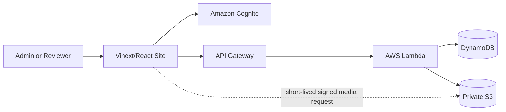

# My Story Factory Development Plan

Status: Approved implementation baseline  
Last updated: September 16, 2026

## 1. Product goal

Turn the current visual demo into a secure, internet-accessible personal story library where:

- the Admin can create, edit, publish, unpublish, and delete stories and media;
- the Reviewer can sign in and read stories but cannot change anything;
- a story can contain any ordered mix of text, images, and video; and
- structured records and uploaded files survive deployments and browser changes.

The current shelf-based demo is the UI baseline. Development should extend it rather than redesign it.

## 2. Decisions at a glance

| Area | Decision |
| --- | --- |
| Initial URL | Keep the existing Sites URL: `https://my-story-factory.juexuanl.chatgpt.site` |
| URL visibility | The address may be public, but stories and APIs remain sign-in protected |
| Optional custom domain | Buy a domain through Amazon Route 53 when desired, then attach it to the hosted Site |
| Authentication | Amazon Cognito User Pool with invitation-only accounts and a persistent signed-in session |
| Roles | Cognito groups named `Admin` and `Reviewer`; authorization is enforced by the backend |
| Structured data | Amazon DynamoDB for users, story metadata, ordered content blocks, and asset metadata |
| Files | A private Amazon S3 bucket for images and videos |
| Backend | Amazon API Gateway + AWS Lambda, deployed as serverless infrastructure |
| Frontend | Keep the current Vinext/React Site and its existing visual language |
| Repository shape | One repository with clear frontend, backend, and infrastructure modules |

This is a hybrid hosting design: Sites continues serving the web interface, while AWS owns identity, application data, and media. It preserves the working demo and satisfies the preference for AWS storage without requiring an immediate frontend rewrite.

## 3. Public URL and domain plan

### Initial launch

The project already has a live Sites URL, so no domain application or purchase is required for the first release:

`https://my-story-factory.juexuanl.chatgpt.site`

The Site is currently restricted to its owner. At launch, the hosting layer can expose the sign-in screen at that URL, while Cognito and the backend continue to protect every story and media request. Publishing the address must never mean publishing private story data anonymously.

### Optional custom domain

If a branded address such as `mystoryfactory.com` is wanted later:

1. Search for and register the domain in [Amazon Route 53](https://docs.aws.amazon.com/Route53/latest/DeveloperGuide/welcome-domain-registration.html), or use another registrar.
2. Attach the domain to the hosted Site and enable its managed HTTPS certificate.
3. Keep the generated `chatgpt.site` address as a fallback until DNS and HTTPS are verified.

Domain purchase is the only step that requires the owner to spend money and choose a name. Do not buy or attach a domain without explicit approval.

## 4. Users, roles, and credentials

### Initial roles

| Capability | Admin | Reviewer |
| --- | ---: | ---: |
| Sign in and remain signed in | Yes | Yes |
| View published stories and media | Yes | Yes |
| View drafts | Yes | No |
| Create and edit stories | Yes | No |
| Upload or remove media | Yes | No |
| Publish, unpublish, or delete stories | Yes | No |
| Invite, disable, or change users | Yes | No |

There will initially be exactly one Admin account for the owner. Reviewer accounts are invitation-only; self-registration is disabled. Amazon Cognito groups support role-based access and place group membership in signed tokens, which the API can validate. See [Amazon Cognito user groups](https://docs.aws.amazon.com/cognito/latest/developerguide/cognito-user-pools-user-groups.html).

### Credential policy

- Cognito manages passwords, password reset, and optional multi-factor authentication.
- The application never stores or logs a plaintext password and never places credentials in source control.
- “Remember me” means a secure persistent sign-in session; browsers and password managers may also save the username and password with the user's consent.
- Prefer secure, HTTP-only cookies where the final authentication flow supports them. Do not store long-lived authentication tokens in `localStorage`.
- Backend authorization is mandatory. Hiding edit buttons from a Reviewer is useful UI behavior, not a security boundary.
- Every write endpoint must require the `Admin` group. Reviewer and anonymous write requests return `403` or `401` respectively.

## 5. Content and storage design

### Format-free story model

A story is metadata plus an ordered list of content blocks. The initial block types are:

- `text`: rich text or Markdown content;
- `image`: an S3 asset reference, alt text, caption, and display options; and
- `video`: an S3 asset reference, poster image, caption, and playback metadata.

The renderer must process blocks in their saved order, so a story can freely alternate text, image, and video. New block types can be added later without changing existing stories.

The initial story record should include at least:

- stable ID and URL slug;
- title, summary, cover asset, and ordered blocks;
- `draft` or `published` status;
- created, updated, and published timestamps; and
- creator/updater identity for an audit trail.

### Recommended database and file combination

Use **DynamoDB + S3**, not a database alone:

- **DynamoDB** stores small, queryable records: stories, ordered block JSON, publishing state, user-role references, and file metadata. It is a fully managed serverless document/key-value database, which fits this small application and avoids maintaining a database server. See [Amazon DynamoDB](https://docs.aws.amazon.com/dynamodb/).
- **S3** stores the actual image and video bytes. The bucket remains private. The database stores object keys and metadata, never the binary file itself.

This combination is preferred over PostgreSQL for the first version because the expected queries are simple, the block model is flexible, and operating cost and maintenance should stay low. Reconsider PostgreSQL only if later requirements include complex reporting, relational workflows, collaborative editing, or advanced full-text search.

### Upload and delivery rules

- An authenticated Admin asks the backend for a short-lived presigned upload URL, then uploads directly to S3.
- A Reviewer can never receive an upload or delete URL.
- The backend validates file type, size, ownership, and story association before finalizing an asset record.
- Signed, time-limited download URLs protect private media. AWS documents presigned URLs for both uploads and downloads: [S3 presigned URLs](https://docs.aws.amazon.com/AmazonS3/latest/userguide/using-presigned-url.html).
- Start with configurable limits, initially 10 MB per image and 250 MB per video. Reject unsupported executable or archive types.
- Enable S3 encryption, versioning, blocked public access, lifecycle rules for abandoned uploads, and a least-privilege IAM policy.
- For larger or frequently streamed videos, add CloudFront and MediaConvert/HLS in a later phase; they are not required for the first working release.

## 6. Frontend and backend structure

Both frontend and backend behavior are necessary, but they do not need separate repositories or a traditional always-running server.

- **Frontend:** login state, current story shelves, story reader, and Admin-only editing controls.
- **Backend:** token validation, role checks, CRUD rules, publish rules, presigned URLs, and audit fields.
- **Infrastructure:** Cognito, API Gateway, Lambda, DynamoDB, S3, IAM, logging, alarms, and deployment configuration defined as code.

Keep these parts in one repository. A reasonable target layout is `app/` for the existing frontend, `backend/` for Lambda/application services, and `infra/` for AWS CDK definitions. Exact folders may be adjusted when implementation starts, but authorization and data access must remain outside UI components.

## 7. UI plan

Preserve the current demo's typography, colors, shelves, covers, reader dialog, bilingual labels, and responsive behavior.

Add only the product surfaces needed for the initial workflow:

1. A sign-in screen and a small signed-in account menu.
2. An Admin toolbar with “New story” and draft/publish controls.
3. A block-based story editor that can add, remove, reorder, and edit text, image, and video blocks.
4. Upload progress, success, empty, and error states.
5. Read-only Reviewer views with no editing affordances.
6. Clear draft indicators visible only to Admin.

Accessibility remains part of the design: keyboard operation, visible focus, dialog labeling, image alt text, video captions when available, and sufficient color contrast.

## 8. Implementation phases

### Phase 0 — Owner setup and final inputs

- Confirm the AWS account and preferred region; default to `us-west-2` if there is no data-residency requirement.
- Add an AWS budget alert before provisioning resources.
- Provide the Reviewer's email when the invitation flow is ready.
- Decide later whether to purchase a custom domain; it is not a launch blocker.

**Exit condition:** AWS deployment access is available and the owner has approved the region and expected spending controls.

### Phase 1 — Infrastructure and authentication

- Add AWS CDK infrastructure for Cognito, API Gateway, Lambda, DynamoDB, S3, IAM, and logs.
- Disable public Cognito self-registration.
- Create `Admin` and `Reviewer` groups and bootstrap the owner as the first Admin.
- Add login, logout, session restoration, and route protection to the frontend.
- Configure CORS for the current Site origin and later the custom domain.

**Exit condition:** Admin and Reviewer test accounts can sign in, their roles are recognized, and anonymous users cannot read story data.

### Phase 2 — Story API and persistence

- Define runtime validation for story and content-block requests.
- Implement list, detail, create, update, publish, unpublish, and delete operations.
- Enforce role checks in every Lambda handler or shared authorization layer.
- Add conditional writes/version fields to prevent accidental overwrites.
- Seed the current demo stories as development data.

**Exit condition:** story records persist in DynamoDB and every mutation is denied to Reviewers.

### Phase 3 — Media pipeline

- Implement presigned image/video uploads and protected reads.
- Record asset metadata only after a successful upload is confirmed.
- Add upload progress, retry, cancel, and failed-upload cleanup.
- Render image and video blocks in their saved positions.

**Exit condition:** an Admin can publish a mixed text/image/video story and a Reviewer can read it without gaining direct write access to S3.

### Phase 4 — Admin editing experience

- Add the block editor while retaining the existing shelf and reader design.
- Support reorder, preview, save draft, publish, unpublish, and delete confirmations.
- Warn about unsaved changes and show clear save/upload status.

**Exit condition:** the owner can manage the complete story lifecycle from the website without editing source files.

### Phase 5 — Security, testing, and operations

- Add unit tests for content validation and authorization policy.
- Add integration tests for the API, DynamoDB records, and S3 signing behavior.
- Add end-to-end tests for anonymous, Admin, and Reviewer journeys.
- Enable DynamoDB point-in-time recovery, S3 versioning/lifecycle rules, CloudWatch logs, alarms, and sanitized error reporting.
- Confirm that secrets, tokens, passwords, signed URLs, and private object keys are not logged.

**Exit condition:** all automated tests pass and the security acceptance checks below are verified in a deployed test environment.

### Phase 6 — Launch

- Migrate the demo data and assets.
- Publish the validated frontend and AWS backend configuration.
- Expose the sign-in screen at the existing Site URL while keeping all content/API access authenticated.
- Invite the real Reviewer and verify read-only behavior with that account.
- Optionally purchase and attach a Route 53 custom domain after explicit owner approval.

**Exit condition:** both real users can use the production URL with the intended permissions, and rollback/recovery steps are documented.

## 9. Acceptance criteria

The initial production version is complete when all of the following are true:

- The website has a stable HTTPS URL reachable outside the developer's computer.
- Anonymous visitors cannot retrieve story records or private media.
- The Admin can create, edit, reorder, publish, unpublish, and delete content.
- The Reviewer can read published text, image, video, and mixed stories but receives a backend denial for every mutation attempt.
- Credentials are managed by Cognito and no plaintext passwords or long-lived tokens are stored by the app.
- Story metadata survives deployments in DynamoDB; images and videos survive deployments in S3.
- S3 Block Public Access is enabled, and media access is short-lived and signed.
- The current demo design remains recognizable on desktop and mobile.
- Automated authorization, content, API, and critical end-to-end tests pass.
- Monitoring, backup/recovery, and an AWS budget alert are enabled.

## 10. Explicit non-goals for the first release

- Open public registration
- More roles than Admin and Reviewer
- Anonymous story viewing
- Comments, likes, social feeds, or real-time collaboration
- Native mobile apps
- Advanced video transcoding or adaptive streaming
- A complete redesign of the current demo
- Multiple AWS regions or enterprise-scale infrastructure

These can be reconsidered after the initial two-user workflow is stable.
